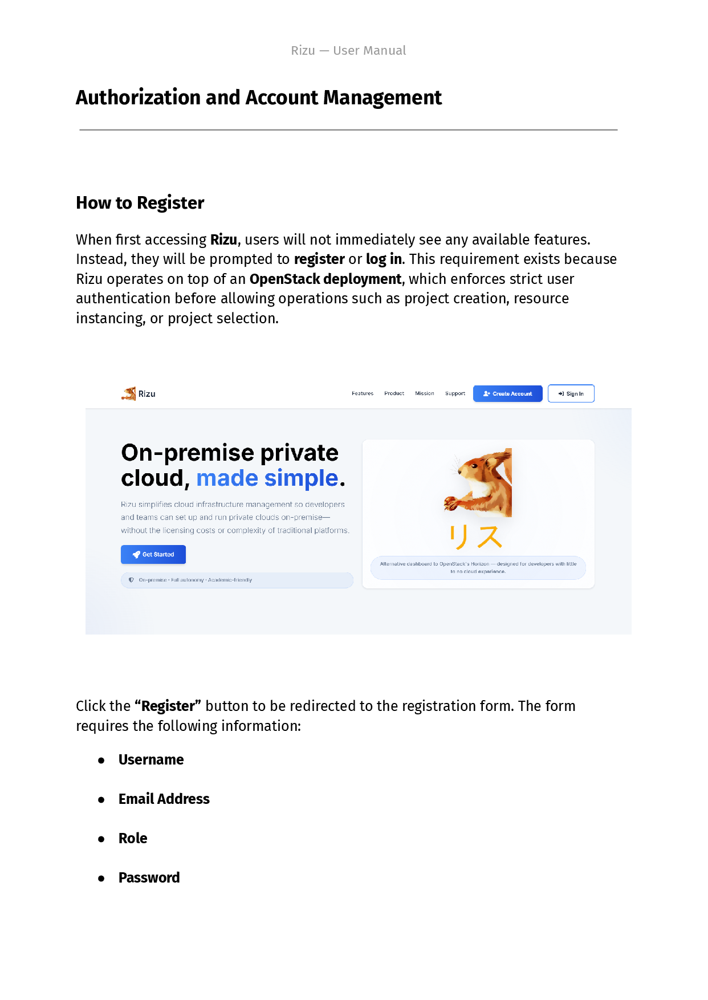

> “Major Major had been born too late and too mediocre. Some men are born
> mediocre, some men achieve mediocrity, and some men have mediocrity thrust
> upon them. With Major Major it had been all three. Even among men lacking all
> distinction he inevitably stood out as a man lacking more distinction than all
> the rest, and people who met him were always impressed by how unimpressive he
> was.”
>
> —Joseph Heller, _Catch-22_

## In a nutshell

During this sprint we:

* Improved the aesthetics of the user interface
* Added block storage capabilities (think AWS EBS)
* Deployed the application (almost) using a Dockerfile
* Wrote a user manual to help onboard new users
* Conducted usability tests to determine UX quality
* Simplified the overall project setup workflow

!!! question "Where's the rest of the business plan?"

    We decided to merge those sections related to the business plan from last
    sprint and the new ones in a new document called [Business Plan](business-plan.md).

<!----------------------------------------------------------------------------->

## Usability Tests Results

> “The most common user action on a Web site is to flee.”
>
> –Edward Tufte, Information Design Guru

!!! tip

     You can see the raw data collected by Paula in the dedicated
     [Usability Tests Results page](usability-tests-results.md)
     :material-page-next-outline:.

### Context

Our UI/UX leader ~~forcibly~~ recruited seven (7) fellow students to complete the
tests outlined during the previous sprint.[^1]

[^1]: During the presentation, we mentioned just four (4) people. It just so
    happens that we did more tests after the presentation was over.

Most of them, young software engineers with little to no experience with cloud
service provider consoles, were able to complete core tasks successfully[^2] and
some even praised the interface for being "modern and clear" (in Spanish).

[^2]: I mean, obviously.

### Problems

They did have some issues with:

* What the "role" is supposed to mean

* The location of the "select a project" dropdown menu

* Navigation through the interface

* Terminology related to cloud services (e.g. "What's a flavor?")

### Metrics

Here are some summary metrics you can take home:

<div class="grid cards" markdown>

- :material-clock-outline: **Average total time:** roughly 9 minutes
- :material-check: **Success rate:** 95%
- :material-alert-circle-outline: **Errors:** 1.6 per user
- :material-star: **Satisfaction rate:** 4.2/5.0

</div>

### Conclusions

We concluded that, while our current user interface is good enough for a
hypothetical user of the platform, we could enhance it by working on:

1. Clarifying what each role does. Perhaps by adding a short explanatory text
   during the sign up flow.

2. Moving the project selector to the top left corner so it's more visible. Or
   making it stand out more.

3. Adding breadcrumb navigation so users can find their way around the site or
   improving on the sidebar's design.

4. Explaining concepts such as flavors in the forms themselves instead of
   expecting the user to have read the manual.[^3]

[^3]: RTFM. Short for "Read The Fine Manual".

<!----------------------------------------------------------------------------->

## User Manual

> “_[reading from the manual]_ The instructions to fit in, have everybody like
> you, and always be happy!”
>
> —Emmet Brickowoski, _The LEGO® Movie_

The User Manual aims to provide a simple, yet effective way to use our
application’s functions and features. Through a verbal step-by-step, the manual
guides the user through the process of interacting with the different systems
(Authorization, VPC creation, Resource provisioning, etc.), as well as providing
screenshots to help users orient themselves inside the application. It also
includes a Frequently Asked Questions (FAQ) section that helps users solve
common issues.

<figure markdown="span">
  { width="400" }
  <figcaption>Table of contents.</figcaption>
</figure>

<figure markdown="span">
  { width="400" }
  <figcaption>Sample of the user manual.</figcaption>
</figure>

<figure markdown="span">
  { width="400" }
  <figcaption>Frequently Asked Questions.</figcaption>
</figure>

!!! info

    Get the [user manual](<assets/sprint-3/Rizu — User Manual.pdf>)
    :material-file-pdf-box:.

<!----------------------------------------------------------------------------->

## Application Deployment

> “Live, from New York, it's Saturday Night!”

### Problems

As I mentioned during the presentation, I wanted to use Docker to deploy our
application on the university DCA's VM, but it wasn't possible. The Kolla
Ansible deployment version of OpenStack appears to have configured the Docker
daemon, in such a way that prevents us from running other containers.

This is the offending file:

```json title="/etc/docker/daemon.json"
{
   "bridge": "none",
   "ip-forward": "false",
   "iptables": "false",
   "log-opts": {
      "max-file": "5",
      "max-size": "50m"
   }
}
```

I searched for a solution online, but changing the `bridge` key [could have
removed all container
networks](https://forums.docker.com/t/docker-does-not-create-bridge-network-by-default/134413/9):

> suggestion to remove the docker network configuration after(!) stopping the
> docker service: `rm -rf /var/lib/docker/network` (warning: as a result all
> container networks will be gone!)

So no, I didn't want to break production one day before the sprint ended.

### Okay, so tell me what you actually did

I ran most of the commands from this Dockerfile but manually:

```docker title="Dockerfile"
# Stage 1: Base build stage
FROM python:3.13-slim AS builder

# Create the app directory
RUN mkdir /app

# Set the working directory
WORKDIR /app

# Set environment variables to optimize Python
ENV PYTHONDONTWRITEBYTECODE=1
ENV PYTHONUNBUFFERED=1

# Upgrade pip and install dependencies
RUN pip install --upgrade pip

# Copy the requirements file first (better caching)
COPY requirements.txt /app/

# Install Python dependencies
RUN pip install --no-cache-dir -r requirements.txt

# Stage 2: Production stage
FROM python:3.13-slim

RUN useradd -m -r appuser && \
   mkdir /app && \
   chown -R appuser /app

# Copy the Python dependencies from the builder stage
COPY --from=builder /usr/local/lib/python3.13/site-packages/ /usr/local/lib/python3.13/site-packages/
COPY --from=builder /usr/local/bin/ /usr/local/bin/

# Set the working directory
WORKDIR /app

# Copy application code
COPY --chown=appuser:appuser . .

# Set environment variables to optimize Python
ENV PYTHONDONTWRITEBYTECODE=1
ENV PYTHONUNBUFFERED=1

# Switch to non-root user
USER appuser

# Expose the application port
EXPOSE 8000

# Start the application using Gunicorn
CMD ["gunicorn", "--bind", "0.0.0.0:8000", "--workers", "3", "Rizu.wsgi:application"]
```

And then I set up a Bash function in our `$HOME/.rizurc` file that invokes
gunicorn:

```
$ tail ~/.rizurc
[ . . . ]

deploy() {
        cd /home/userdca/rizu && gunicorn --bind 0.0.0.0:42000 --workers 3 Rizu.wsgi:application
}
```

It's a manual deployment with some command automation.

When you bind it to port 42000, the application can be accessed at
`rizu.dis.eafit.edu.co`. We are running it on demand, so it's surely
inaccessible by the time you are reading this.

!!! note

    What could be improved? We could try [Podman](https://podman.io) to deploy
    a containerized version of our application that doesn't interfere with the
    Docker network configurations.
